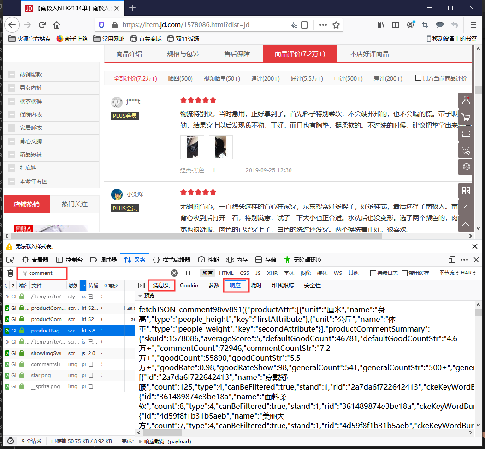
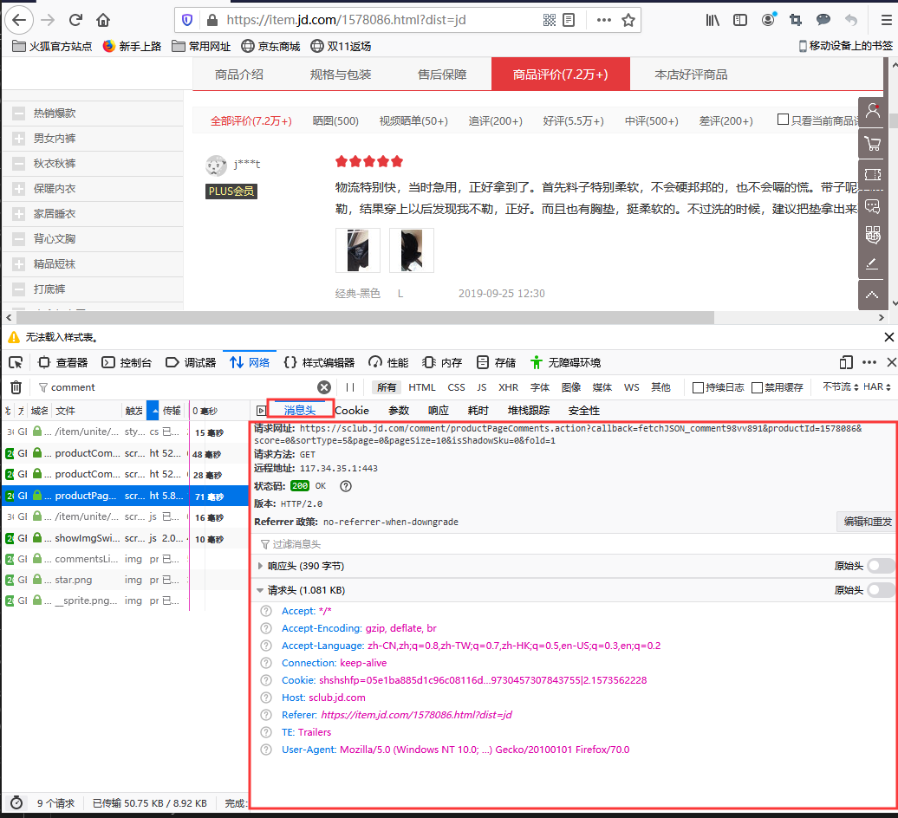
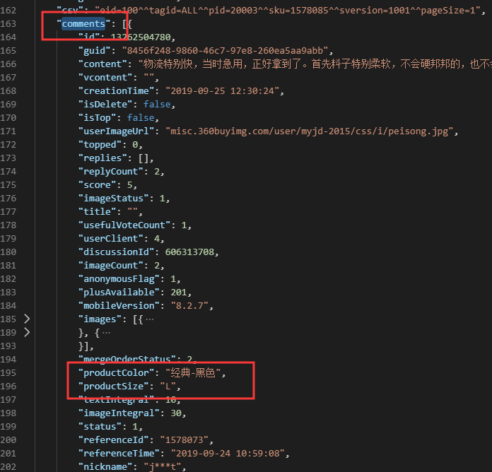
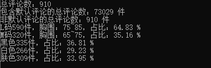

## 网络爬虫基础知识

### 什么网络爬虫
通俗的说网络爬虫就是一种安装一定规则，自动抓取网络信息的程序或脚本。

### 网络爬虫能干什么
1.比如百度，Google等互联网搜索引擎或其他类似网站，使用网络爬虫自动采集所有其能够访问到的页面内容，以获取或更新这些网站的内容和检索方式，供搜索引擎做进一步处理，从而使用户能更快的检索到他们需要的信息。
2.可以使用网络爬虫抓取证券交易数据，天气数据，网站用户数据，图片等有用的数据。
总之一句话，浏览器能浏览到的所有数据，网络爬虫都能获取到。

### 网络爬虫基本处理流程
1. 伪装成浏览器向Web服务器发起请求
2. 获取Web服务器的响应
4. 解析响应数据
5. 保存数据
6. 对数据进行可视化整理，展示

### 网络爬虫基本框架

### 网络爬虫处理流程图

##  Python爬虫爬取双十一京东文胸数据，获取女朋友们真是罩杯和喜好

### 程序处理流程
1. 获取评论最多文胸的所有评论信息
2. 根据评论信息，整理出各种型号的销售量，各种颜色的销售量，以及所有评价内容
3. 统计各种型号，各种颜色的销售占比
4. 对所有的评价内容进行分词操作
5. 整理评价内容中的词汇，做成词云展示

### 程序设计
#### 调查京东商品评论接口
1. 打开京东商城文胸评论数量第一的网页，按`F12`打开开发者界面，选中`网络`选项卡，过滤框中输入`comment`，按`F5`刷新页面。如下图，我们可以定位到京东商品评论的请求的通信

2. 打开右侧的`消息头`选项卡，可以看到该通信使用的Web请求网址和请求头

3. 分析Web请求信息，获得京东商品评论接口

Web请求地址：https开头到？之间的字符串（这块为了避免百家号误检查广告嫌疑，就不直接贴网址信息了）
Web请求参数：？之后所有的字符串，以&分割组成Key=value的键值对。
请求头里面的`Referer`和`User-Agent`也很关键，京东Web服务器有反爬虫机制，我们在使用python爬虫模拟发起Web请求的时候，需要在headers中加入这些信息。

4. 分析京东Web服务器返回数据的格式

作为一名程序员，通过命名就能很容的判断comments字段就是商品的评论信息

好了，到目前为止，发送Web请求的API接口，响应数据的格式我们基本都搞明白了，接下来就是实际写代码了。

#### 实装代码

1. 使用 python 的`requests`库，模拟浏览器的请求抓取评论信息

2. 根据总评论页数循环发送请求，取得所有评论信息

3. 整理评论信息中的罩杯大小信息，颜色信息和品论内容 （此阶段也可以把数据保存到数据库中供今后分析使用）

4. 分析统计罩杯销量信息，颜色喜好信息，打印输出（此阶段可以使用一些可视化工具，进行更加友好的数据展示）

5. 数据整理（jieba）

6. 词云（jieba）
生成云词我们需要用到numpy、matplotlib、wordcloud、Pillow这几个库，大家先自行下载。matplotlib库用于图像处理，wordcloud库用于生成词云。

### 总结
文章篇幅较长，详细的介绍了从需求到技术分析、爬取数据、清洗数据、最后的分析数据。来总结一下吧：

1. 如何分析并找出加载数据的url
2. 如何使用requests库的headers解决Referer和User-Agent反扒技术
3. 如何找出分页参数实现批量爬取
4. 数据的提取与保存到文件
5. 使用jieba库对数据分词清洗
6. 使用wordcloud生成指定形状的词云