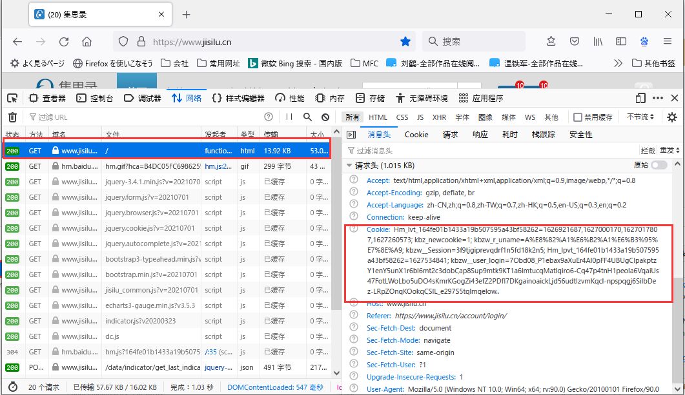
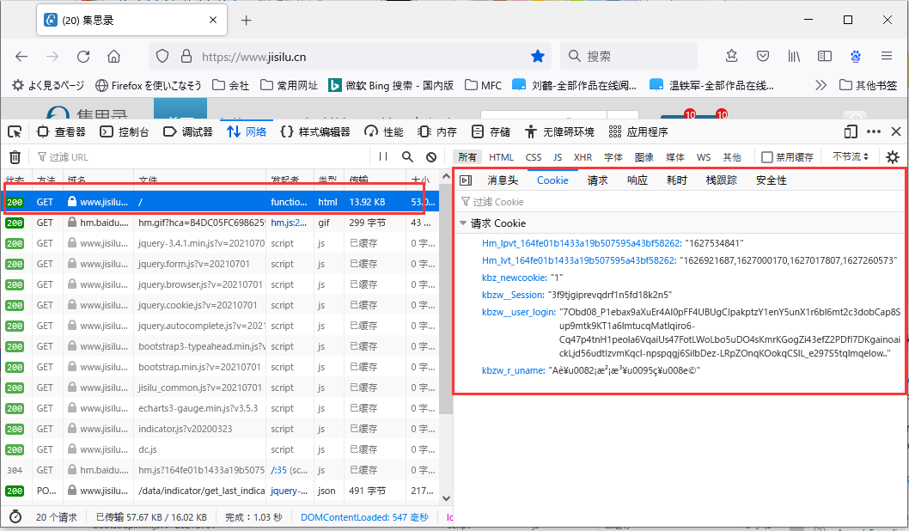
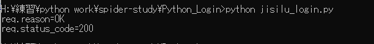

# Python常用爬虫技术“登录/Login”

现在很多网站为了保护会员数据，经常将未登录用户进行普通游客对待，只展示非常有限的数据。使用Python爬虫获取网站的数据的时候，我们就需要模拟登录，以获得更多可以的分析数据，例如，“集思录”网站，普通游客每次只能看到可转债列表的前`30`条数据，登录后才可以查看完整的`382`条数据。
那么使用爬虫模拟“登录”就变得非常有用了。

## 模拟登录的开发流程
1. 分析目标网站登录请求
2. 模拟登录请求
3. 确认模拟登录的返回结果

## 分析目标网站登录请求
下面我们以国内低风险投资网站“集思录”为例进行分析。

1. 打开“集思录”登录画面，按F2打开浏览器开发者界面后切换到“网络”页面，如下图。输入用户名和密码后点击“登录”。

2. 分析请求
通过分析我们发现，该网站登录是通过`Get`方法，将下面的Cookie的数据附带在http的请求头中发送给`https://www.jisilu.cn/account/login/`，进行登录。

3. 经过重复`1，2两步`的操作，分析`Cookie`数据后发现，`Hm_lpvt_164fe01b1433a19b507595a43bf58262`的值是一个可变数据，推测应该是请求时刻。其他的Cookie是固定数据，对应用户名和密码等的加密数据。

## 模拟登录请求
1. 经过上面的分析，我们只需要模拟一套Cookie数据，应该就可以登录“集思录”。
* `Hm_lpvt_164fe01b1433a19b507595a43bf58262`的模拟
```python
cookies['Hm_lpvt_164fe01b1433a19b507595a43bf58262']=str(int(time.time()))
```
* 从F2的开发者画面，复制其他`Cookie`数据
```python
   cookies['Hm_lvt_164fe01b1433a19b507595a43bf58262']='1626921687,1627000170,1627017807,1627260573'
    cookies['kbz_newcookie']='1'
    cookies['kbzw__Session']='3f9tjgiprevqdrf1n5fd18k2n5'
    cookies['kbzw__user_login']='7Obd08_P1ebax9aXuEr4Al0pFF4UBUgCIpakptzY1enY5unX1r6bl6mt2c3dobCap8Sup9mtk9KT1a6lmtucqMatlqiro6-Cq47p4tnH1peola6VqaiUs47FotLWoLbo5uDO4sKmrKGogZi43efZ2PDfl7DKgainoaickLjd56udtIzvmKqcl-npspqgj6SilbDez-LRpZOnqKOokqCSlL_e297S5tqlmqelow..'
    username='A股没法玩'
    name=username.encode("utf-8").decode('latin1')
    cookies['kbzw_r_uname']=name
```
2. 测试，完整代码如下
```python
#!/usr/bin/python
# -*- coding: UTF-8 -*-
import requests
import time

if __name__ == "__main__":
    target = 'https://www.jisilu.cn/account/login/'
    cookies={}
    cookies['Hm_lpvt_164fe01b1433a19b507595a43bf58262']=str(int(time.time()))
    cookies['Hm_lvt_164fe01b1433a19b507595a43bf58262']='1626921687,1627000170,1627017807,1627260573'
    cookies['kbz_newcookie']='1'
    cookies['kbzw__Session']='3f9tjgiprevqdrf1n5fd18k2n5'
    cookies['kbzw__user_login']='7Obd08_P1ebax9aXuEr4Al0pFF4UBUgCIpakptzY1enY5unX1r6bl6mt2c3dobCap8Sup9mtk9KT1a6lmtucqMatlqiro6-Cq47p4tnH1peola6VqaiUs47FotLWoLbo5uDO4sKmrKGogZi43efZ2PDfl7DKgainoaickLjd56udtIzvmKqcl-npspqgj6SilbDez-LRpZOnqKOokqCSlL_e297S5tqlmqelow..'
    username='A股没法玩'
    name=username.encode("utf-8").decode('latin1') #中文用户名进行utf8编码
    cookies['kbzw_r_uname']=name
    requests.packages.urllib3.disable_warnings() #消除https请求是缺少证书的警告
    req = requests.get(url=target,cookies=cookies,verify=False)
    print(req.reason)
    print(req.status_code)
    #print(req.content) #输出响应数据
```
3. 确认结果


## 终结
各个网站的登录请求，千变万化，都不一样。重点是我需要通过网站登录请求的找到登录处理的http通信，以及通过分析http请求头，请求数据，`Cookie`数据，找到登录是需要的核心数据。然后模拟登录的http通信请求，使用`requests`库完成模拟登录。
